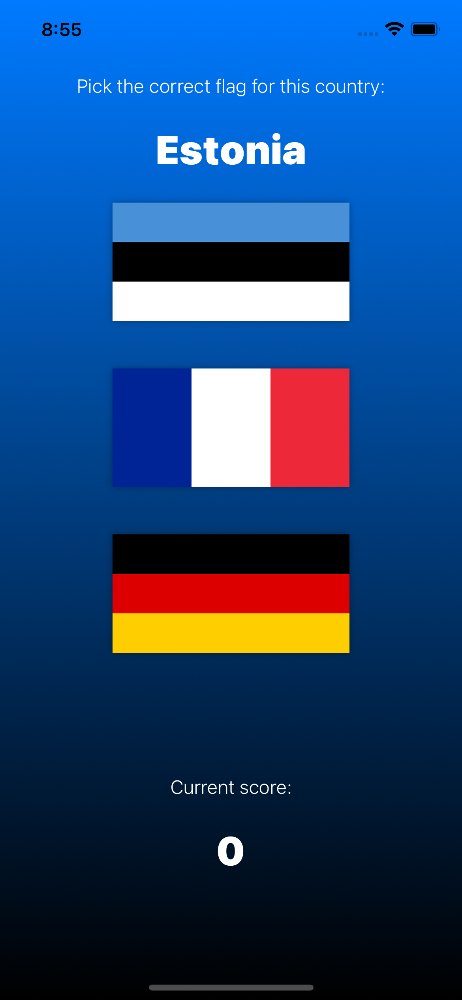
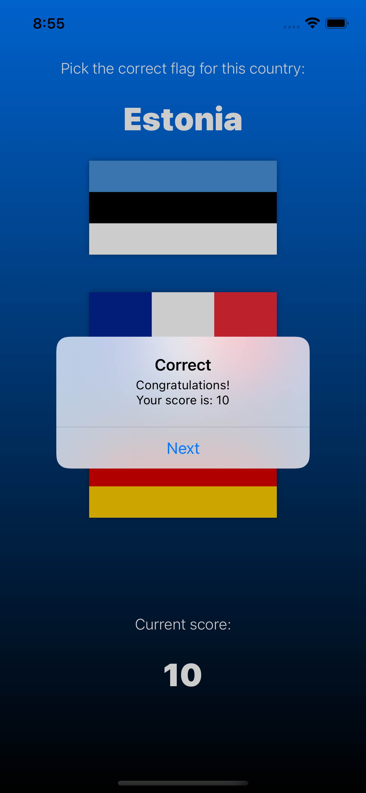
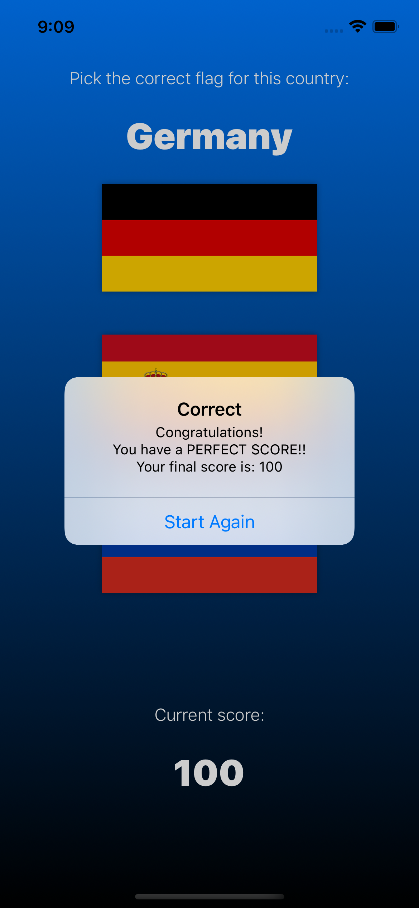

# Project 2

March 29th 2021

|                        |                        |                        |
|:----------------------:|:----------------------:|:----------------------:|
|   |   |   |

## [Project 2, Part One](https://www.hackingwithswift.com/100/swiftui/20)

* [Guess the Flag: Introduction](https://www.hackingwithswift.com/books/ios-swiftui/guess-the-flag-introduction)
* [Using stacks to arrange views](https://www.hackingwithswift.com/books/ios-swiftui/using-stacks-to-arrange-views)
* [Colors and frames](https://www.hackingwithswift.com/books/ios-swiftui/colors-and-frames)
* [Gradients](https://www.hackingwithswift.com/books/ios-swiftui/gradients)
* [Buttons and images](https://www.hackingwithswift.com/books/ios-swiftui/buttons-and-images)
* [Showing alert messages](https://www.hackingwithswift.com/books/ios-swiftui/showing-alert-messages)

### [Building Layouts with Stack Views](https://developer.apple.com/documentation/swiftui/building-layouts-with-stack-views)

Individually, [HStack](https://developer.apple.com/documentation/swiftui/hstack), [VStack](https://developer.apple.com/documentation/swiftui/vstack), and [ZStack](https://developer.apple.com/documentation/swiftui/zstack) are simple views. HStack positions views in a horizontal line, VStack positions them in a vertical line, and ZStack overlays views on top of one another.

**[VStack](https://developer.apple.com/documentation/swiftui/vstack)**

Just like SwiftUI’s other views, VStack can have a maximum of 10 children – if you want to add more, you should wrap them inside a Group.

By default, VStack aligns its views so they are centered, but you can control that with its alignment property. For example, this aligns the text views to their leading edge, which in a left-to-right language such as English will cause them to be aligned to the left:

~~~
VStack(alignment: .leading) {
    Text("Hello World")
    Text("This is inside a stack")
}
~~~

**[HStack](https://developer.apple.com/documentation/swiftui/hstack)**

HStack has the same syntax as VStack, including the ability to add spacing and alignment:

~~~
HStack(spacing: 20) {
    Text("Hello World")
    Text("This is inside a stack")
}
~~~

VStack and HStack can be combined and customized with **view modifiers**, like **Spacer** and **Divider**.

**Spacer** views will automatically take up all remaining space, so if you add one at the end a VStack it will push all your views to the top of the screen:

~~~
VStack {
    Text("First")
    Text("Second")
    Text("Third")
    Spacer()
}
~~~

**[ZStack](https://developer.apple.com/documentation/swiftui/zstack)**

**ZStack** used for arranging things by depth – it makes views that overlap. In the case of our two text views, this will make things rather hard to read:

~~~
ZStack {
    Text("Hello World")
    Text("This is inside a stack")
}
~~~

ZStack doesn’t have the concept of spacing because the views overlap, but it does have alignment. So, if you have one large thing and one small thing inside your ZStack, you can make both views align to the top like this: ZStack(alignment: .top).

ZStack draws its contents from top to bottom, back to front. This means if you have an image then some text ZStack will draw them in that order, placing the text on top of the image.

### [Colors and Frames](https://www.hackingwithswift.com/books/ios-swiftui/colors-and-frames)

Using the **background()** modifier, to give a color background like this:

~~~
ZStack {
    Text("Your content")
}
.background(Color.red)
~~~

That might have done what you expected, but there’s a good chance it was a surprise: only the text view had a background color, even though we’ve asked the whole ZStack to have it.

In fact, there’s no difference between that code and this:

~~~
ZStack {
    Text("Your content")
        .background(Color.red)
}
~~~

If you want to fill in red the whole area behind the text, you should place the color into the ZStack – treat it as a whole view, all by itself:

~~~
ZStack {
    Color.red
    Text("Your content")
}
~~~

**Color.red** is a view in its own right, which is why it can be used like shapes and text. It automatically takes up all the space available.

You can also use the frame() modifier to ask for specific sizes:

~~~
Color.red.frame(width: 200, height: 200)
~~~

Even when taking up the full screen, you’ll see that using Color.red will leave some space white.

How much space is white depends on your device, but on iPhone X designs – iPhone X, XS, and 11 – you’ll find that both the status bar (the clock area at the top) and the home indicator (the horizontal stripe at the bottom) are left uncolored.

If you want your content to go under the safe area, you can use the edgesIgnoringSafeArea() modifier to specify which screen edges you want to run up to.

~~~
ZStack {
    Color.red.edgesIgnoringSafeArea(.all)
    Text("Your content")
}
~~~

### [Gradients](https://www.hackingwithswift.com/books/ios-swiftui/gradients)

Gradients are made up of several components:

* An array of colors to show.
* Size and direction information.
* The type of gradient to use.

**Linear gradient** goes in one direction, so we provide it with a start and end point like this:

~~~
LinearGradient(gradient: Gradient(colors: [.white, .black]), startPoint: .top, endPoint: .bottom)
~~~

**Radial gradient** moves outward in a circle shape, so instead of specifying a direction we specify a start and end radius – how far from the center of the circle the color should start and stop changing. For example:

~~~
RadialGradient(gradient: Gradient(colors: [.blue, .black]), center: .center, startRadius: 20, endRadius: 200)
~~~

**Angular gradient** (conic or conical gradient), cycles colors around a circle rather than radiating outward, and can create some beautiful effects.
For example, this cycles through a range of colors in a single gradient, centered on the middle of the gradient:

~~~
AngularGradient(gradient: Gradient(colors: [.red, .yellow, .green, .blue, .purple, .red]), center: .center)
~~~

All of these gradients are able to stand alone as views, or be used as part of a modifier – you can use them as the background for a text view, for example.

### [Buttons and Images](https://www.hackingwithswift.com/books/ios-swiftui/buttons-and-images)

Buttons in SwiftUI can be made in two ways depending on how they should look.

The simplest way to make a button is when it just contains some text: you pass in the title of the button, along with a closure that should be run when the button is tapped:

~~~
Button("Tap me!") {
    print("Button was tapped")
}
~~~

If you want something more, such as an image or a combination of views, you can use this alternative form

~~~
Button(action: {
    print("Button was tapped")
}) { 
    Text("Tap me!")
}
~~~

SwiftUI has a dedicated Image type for handling pictures in your apps, and there are three main ways you will create them:

* Image("pencil") will load an image called “Pencil” that you have added to your project.
  
* Image(decorative: "pencil") will load the same image, but won’t read it out for users who have enabled the screen reader. This is useful for images that don’t convey additional important information.
  
* Image(systemName: "pencil") will load the pencil icon that is built into iOS. This uses Apple’s SF Symbols icon collection, and you can search for icons you like – download Apple’s free SF Symbols app from the web to see the full set.

Because the longer form of buttons can have any kind of views inside them, you can use images like this:

~~~
Button(action: {
    print("Edit button was tapped")
}) { 
    Image(systemName: "pencil")
}
~~~

And of course you can combine these with stacks to make more advanced button layouts:

~~~
Button(action: {
    print("Edit button was tapped")
}) {
    HStack(spacing: 10) { 
        Image(systemName: "pencil")
        Text("Edit")
    }
}
~~~

>NOTE
>>Tip: If you find that your images have become filled in with a color, for example showing as solid blue rather than your actual picture, this is probably SwiftUI coloring them to show that they are tappable. To fix the problem, use the renderingMode(.original) modifier to force SwiftUI to show the original image rather than the recolored version.

### [Showing Alert Messages](https://www.hackingwithswift.com/books/ios-swiftui/showing-alert-messages)

We create alert and set the conditions under which it should be shown.
A basic SwiftUI alert has a title, message, and one dismiss button, like this:

~~~
Alert(title: Text("Hello SwiftUI!"), message: Text("This is some detail message"), dismissButton: .default(Text("OK")))
~~~

You can add more code to configure the buttons in more detail if you want, but that’s enough for now. More interesting is how we present that alert: we don’t assign the alert to a variable then write something like myAlert.show(), because that would be back the old “series of events” way of thinking.

Instead, we create some state that tracks whether our alert is showing, like this:

~~~
@State private var showingAlert = false
~~~

We then attach our alert somewhere to our user interface, telling it to use that state to determine whether the alert is presented or not. SwiftUI will watch **showingAlert**, and as soon as it becomes true it will show the alert.

Putting that all together, here’s some example code that shows an alert when a button is tapped:

~~~
struct ContentView: View {
    @State private var showingAlert = false

    var body: some View {
        Button("Show Alert") {
            self.showingAlert = true
        }
        .alert(isPresented: $showingAlert) {
            Alert(title: Text("Hello SwiftUI!"), message: Text("This is some detail message"), dismissButton: .default(Text("OK")))
        }
    }
}
~~~

That’s another two-way data binding, and it’s here because SwiftUI will automatically set **showingAlert** back to false when the alert is dismissed.

## [Project 2, Part Two](https://www.hackingwithswift.com/100/swiftui/21)

* [Stacking up buttons](https://www.hackingwithswift.com/books/ios-swiftui/stacking-up-buttons)
* [Showing the player’s score with an alert](https://www.hackingwithswift.com/books/ios-swiftui/showing-the-players-score-with-an-alert)
* [Styling our flags](https://www.hackingwithswift.com/books/ios-swiftui/styling-our-flags)

### [Stacking up Buttons](https://www.hackingwithswift.com/books/ios-swiftui/stacking-up-buttons)

Build the basic UI structure: 

1. Two labels telling the user what to do.
2. Three image buttons showing three world flags.

### [Showing the Player’s Score with an Alert](https://www.hackingwithswift.com/books/ios-swiftui/showing-the-players-score-with-an-alert)

We can add action/function as trailing closure to alert:

~~~
.alert(isPresented: $showingScore) {
    Alert(title: Text(scoreTitle), message: Text("Your score is ???"), dismissButton: .default(Text("Continue")) {
        self.askQuestion()
    })
}
~~~

### [Styling our Flags](https://www.hackingwithswift.com/books/ios-swiftui/styling-our-flags)

~~~
.font(.largeTitle)
~~~

**Large title** is the largest built-in font size iOS offers us, and automatically scales up or down depending on what setting the user has for their fonts – a feature known as Dynamic Type.

There are four built-in shapes in Swift: rectangle, rounded rectangle, circle, and capsule.

Making our image **capsule** shaped is as easy as adding the **.clipShape(Capsule())** modifier, like this:

~~~
.clipShape(Capsule())
~~~

Drawing a border around the image can be done using the **overlay()** modifier. This lets us draw another view over the flag, which in our case will be a capsule that has a black stroke around its edge. So, add this modifier after clipShape():

~~~
.overlay(Capsule().stroke(Color.black, lineWidth: 1))
~~~

Adding shadow effect around flag can be done using **shadow()**, which takes the color, radius, X, and Y offset of the shadow, but if you skip X and Y it assumes 0 for them. So, add this last modifier below the previous two:

~~~
.shadow(color: .black, radius: 2)
~~~

## [Project 2, Part Three](https://www.hackingwithswift.com/100/swiftui/22)

* [Guess the Flag: Wrap up](https://www.hackingwithswift.com/books/ios-swiftui/guess-the-flag-wrap-up)
* [Review for Project 2: Guess the Flag](https://www.hackingwithswift.com/review/ios-swiftui/guess-the-flag)