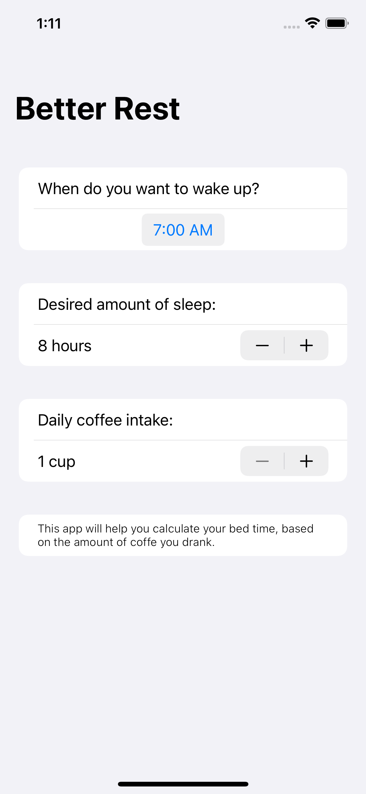
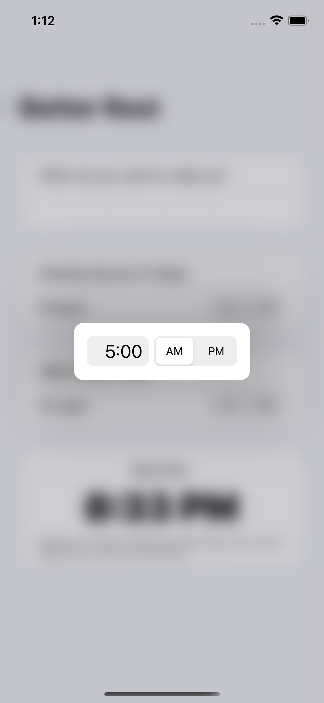
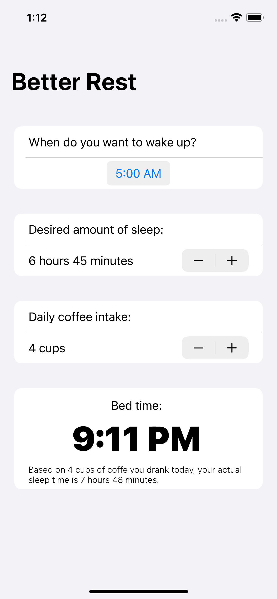

# Expanding your skills

April 10th 2021

|                        |                        |                        |
|:----------------------:|:----------------------:|:----------------------:|
|   |   |   |

## [Project 4, part one](https://www.hackingwithswift.com/100/swiftui/26)

* [BetterRest: Introduction](https://www.hackingwithswift.com/books/ios-swiftui/betterrest-introduction)
* [Entering numbers with Stepper](https://www.hackingwithswift.com/books/ios-swiftui/entering-numbers-with-stepper)
* [Selecting dates and times with DatePicker](https://www.hackingwithswift.com/books/ios-swiftui/selecting-dates-and-times-with-datepicker)
* [Working with dates](https://www.hackingwithswift.com/books/ios-swiftui/working-with-dates)
* [Training a model with Create ML](https://www.hackingwithswift.com/books/ios-swiftui/training-a-model-with-create-ml)

The actual app we’re build is called BetterRest, and it’s designed to help coffee drinkers get a good night’s sleep by asking them three questions:

1. When do they want to wake up?
2. Roughly how many hours of sleep do they want?
3. How many cups of coffee do they drink per day?

Once we have those three values, we’ll feed them into Core ML to get a result telling us when they ought to go to bed.

Using a technique called regression analysis we can ask the computer to come up with an algorithm able to represent all our data. This in turn allows it to apply the algorithm to fresh data it hasn’t seen before, and get accurate results.

SwiftUI has two ways of letting users enter numbers, **Stepper** and **Slider**.

Steppers are smart enough to work with any kind of number type you like – you can bind them to Int, Double, and more, and it will automatically adapt.

By default steppers are limited only by the range of their storage. We’re using a Double in this example, which means the maximum value of the slider will be 1.7976931348623157e+308. That’s scientific notation, but it means “1.79769 times 10 to the power of 308”.

Stepper lets us limit the values we want to accept by providing an in range, like this:

~~~
Stepper(value: $sleepAmount, in: 4...12) {
    Text("\(sleepAmount) hours")
}
~~~

We can also specify the step:

~~~
Stepper(value: $sleepAmount, in: 4...12, step: 0.25) {
    Text("\(sleepAmount) hours")
}
~~~

The **“%g”** specifier on Text is useful, because it automatically removes insignificant zeroes from the end of the number.

SwiftUI gives us a dedicated picker type called DatePicker that can be bound to a date property. Swift has a dedicated type for working with dates, and it’s called **Date**.

Date pickers provide us with a couple of configuration options that control how they work. First, we can use displayedComponents to decide what kind of options users should see:

* If you don’t provide this parameter, users see a day, hour, and minute.
* If you use .date users see month, day, and year.
* If you use .hourAndMinute users see just the hour and minute components.

>Fun Fact
>> Try running cal 9 1752, it will shows you the calendar for September 1752 – you’ll notice 12 whole days are missing, thanks to the calendar moving from Julian to Gregorian.

In the project we’re making we’ll be using dates in three ways:

1. Choosing a sensible default “wake up” time.
2. Reading the hour and minute they want to wake up.
3. Showing their suggested bedtime neatly formatted.

Swift gives us Date for working with dates, and that encapsulates the year, month, date, hour, minute, second, timezone, and more. It also allow us to specifically choose the component(s), rather than the whole thing, called **DateComponents**.

~~~
var components = DateComponents()
    components.hour = 8
    components.minute = 0
let date = Calendar.current.date(from: components)
~~~

How we could read the hour user want to wake up? Remember, **DatePicker** is bound to a Date giving us lots of information, so we need to find a way to pull out just the hour and minute components.

We can ask for the hour and minute from **DateComponents**, but we’ll be handed back a DateComponents instance with optional values for all its properties. Yes, we know hour and minute will be there because those are the ones we asked for, but we still need to unwrap the optionals or provide default values.

~~~
let components = Calendar.current.dateComponents([.hour, .minute], from: someDate)
let hour = components.hour ?? 0
let minute = components.minute ?? 0
~~~

How we can format dates and times? Swift gives us a specific type to do most of the work for us. This time it’s called **DateFormatter**, and it lets us convert a date into a string in a variety of ways.

~~~
let formatter = DateFormatter()
    formatter.timeStyle = .short
let dateString = formatter.string(from: Date())
~~~

Core ML is capable of handling a variety of training tasks, such as recognizing images, sounds, and even motion, but in this instance we’re going to look at tabular regression.

That’s a fancy name, which is common in machine learning, but all it really means is that we can throw a load of spreadsheet-like data at Create ML and ask it to figure out the relationship between various values.

Machine learning is done in two steps: we train the model, then we ask the model to make predictions. Training is the process of the computer looking at all our data to figure out the relationship between all the values we have, and in large data sets it can take a long time – easily hours, potentially much longer. Prediction is done on device: we feed it the trained model, and it will use previous results to make estimates about new data.

Open the Create ML app on your Mac, from Xcode go to the Xcode menu and choose Open Developer Tool > Create ML.

* The first step is to provide Create ML with some training data. This is the raw statistics for it to look at, which in our case consists of four values: when someone wanted to wake up, how much sleep they thought they liked to have, how much coffee they drink per day, and how much sleep they actually need.
* The next job is to decide the target, which is the value we want the computer to learn to predict, and the features, which are the values we want the computer to inspect in order to predict the target. For example, if we chose how much sleep someone thought they needed and how much sleep they actually needed as features, we could train the computer to predict how much coffee they drink.
* Below the Select Features button is a dropdown button for the algorithm, and there are five options: Automatic, Random Forest, Boosted Tree, Decision Tree, and Linear Regression. 

Linear regressors are the easiest to understand, because it’s pretty much exactly how our brain works. They attempt to estimate the relationships between your variables by considering them as part of a linear function such as applyAlgorithm(var1, var2, var3). The goal of a linear regression is to be able to draw one straight line through all your data points, where the average distance between the line and each data point is as small as possible.

Decision tree regressors form a natural tree structure letting us organize information as a series of choices. Try to envision this almost like a game of 20 questions: “are you a person or an animal? If you’re a person, are you alive or dead? If you’re alive, are you young or old?” And so on – each time the tree can branch off depending on the answer to each question, until eventually there’s a definitive answer.

Boosted tree regressors work using a series of decision trees, where each tree is designed to correct any errors in the previous tree. For example, the first decision tree takes its best guess at finding a good prediction, but it’s off by 20%. This then gets passed to a second decision tree for further refinement, and the process repeats – this time, though, the error is down to 10%. That goes into a third tree where the error comes down to 8%, and a fourth tree where the error comes down to 7%.

The random forest model is similar to boosted trees, but with a slight difference: with boosted trees every decision in the tree is made with access to all available data, whereas with random trees each tree has access to only a subset of data.

This might sound bizarre: why would you want to withhold data? Well, imagine you were facing a coding problem and trying to come up with a solution. If you ask a colleague for ideas, they will give you some based on what they know. If you ask a different colleague for ideas, they are likely to give you different ideas based on what they know. And if you asked a hundred colleagues for ideas, you’ll get a range of solutions.

Each of your colleagues will have a different background, different education, and a different job history than the others, which is why you get a range of suggestions. But if you average out the suggestions across everyone – go with whatever most people say, regardless of what led them to that decision – you have the best chance of getting the right solution.

This is exactly how random forest regressors work: each decision tree has its own view of your data that’s different to other trees, and by combining all their predictions together to make an average you stand a great chance of getting a strong result.

Automatic option will attempts to choose the best algorithm automatically. It’s not always correct, and in fact it does limit the options we have quite dramatically, but for this project it’s more than good enough.

## [Project 4, part two](https://www.hackingwithswift.com/100/swiftui/27)

* [Building a basic layout](https://www.hackingwithswift.com/books/ios-swiftui/building-a-basic-layout)
* [Connecting SwiftUI to Core ML](https://www.hackingwithswift.com/books/ios-swiftui/connecting-swiftui-to-core-ml)
* [Cleaning up the user interface](https://www.hackingwithswift.com/books/ios-swiftui/cleaning-up-the-user-interface)

This app is going to allow user input with a date picker and two steppers, which combined will tell us when they want to wake up, how much sleep they usually like, and how much coffee they drink.

When you add an .mlmodel file to Xcode, it will automatically create a Swift class of the same name. You can’t see the class, and don’t need to – it’s generated automatically as part of the build process. However, it does mean that if your model file is named oddly then the auto-generated class name will also be named oddly.

In my case, I had a file called “BetterRest 1.mlmodel”, which meant Xcode would generate a Swift class called BetterRest_1. No matter what name your model file has, please rename it to be “SleepCalculator.mlmodel”, thus making the auto-generated class be called SleepCalculator.

Create an instance of the SleepCalculator class, like this:

~~~
let model = SleepCalculator()
~~~

That’s the thing that reads in all our data, and will output a prediction. We trained our model with a CSV file containing the following fields:

* “wake”: when the user wants to wake up. This is expressed as the number of seconds from midnight, so 8am would be 8 hours multiplied by 60 multiplied by 60, giving 28800.
* “estimatedSleep”: roughly how much sleep the user wants to have, stored as values from 4 through 12 in quarter increments.
* “coffee”: roughly how many cups of coffee the user drinks per day.

So, in order to get a prediction out of our model, we need to fill in those values.

Feeding our values into Core ML might fail if Core ML hits some sort of problem, so we need to use do and catch.

So, we’re going to create a do/catch block, and inside there use the prediction() method of our model. This wants the wake time, estimated sleep, and coffee amount values required to make a prediction, all provided as Double values. We just calculated our hour and minute as seconds, so we’ll add those together before sending them in.

~~~
do {
    let prediction = try model.prediction(wake: Double(hour + minute), estimatedSleep: sleepAmount, coffee: Double(coffeeAmount))

    // more code here
} catch {
    // something went wrong!
}
~~~

With that in place, prediction now contains how much sleep they actually need. This almost certainly wasn’t part of the training data our model saw, but was instead computed dynamically by the Core ML algorithm.

However, it’s not a helpful value for users – it will be some number in seconds. What we want is to convert that into the time they should go to bed, which means we need to subtract that value in seconds from the time they need to wake up.

Thanks to Apple’s powerful APIs, that’s just one line of code – you can subtract a value in seconds directly from a Date, and you’ll get back a new Date! So, add this line of code after the prediction:

~~~
let sleepTime = wakeUp - prediction.actualSleep
~~~

And now we know exactly when they should go to sleep. Our final challenge is to show that to the user.

[Get decimal part](https://stackoverflow.com/questions/31396301/getting-the-decimal-part-of-a-double-in-swift)

## [Project 4, part three](https://www.hackingwithswift.com/100/swiftui/28)

* [BetterRest: Wrap up](https://www.hackingwithswift.com/books/ios-swiftui/betterrest-wrap-up)
* [Review for Project 4: BetterRest](https://www.hackingwithswift.com/review/ios-swiftui/betterrest)